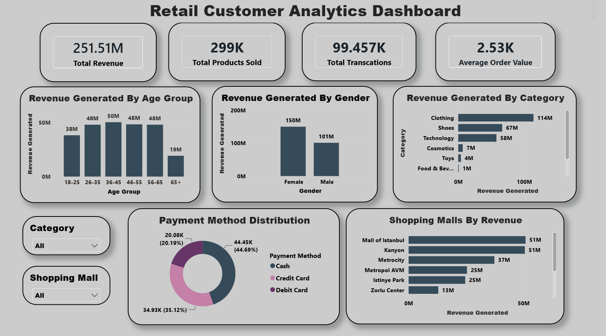

# Customer Sales Analysis

## Overview
This project analyzes customer sales data using SQL and Power BI to identify sales trends, customer purchasing behavior, and business performance. An interactive dashboard was developed to help visualize key metrics and support data-driven decision-making.

## Tools & Technologies
- SQL (MySQL)
- Power BI
- Power Query
- DAX

## Project Workflow
- Extracted data using SQL queries.
- Imported and transformed data in Power BI.
- Cleaned and prepared the dataset using Power Query.
- Created KPIs and interactive visualizations.
- Built an interactive dashboard to analyze customer sales performance.
- Generated business insights and recommendations.

## Files
- 📊 Power BI Dashboard (.pbix)
- 🗄️ SQL Queries (.sql)
- 📄 Project Report
- 📽️ Project Presentation
- 🖼️ Dashboard Screenshot

## Key Features
- Interactive dashboard with slicers and filters.
- Sales trend analysis.
- Customer performance analysis.
- Product/category performance analysis.
- KPI cards for business metrics.
- Dynamic visualizations for better decision-making.

## Dashboard Preview

## Conclusion
The dashboard provides valuable insights into customer purchasing behavior and sales performance, helping businesses monitor trends, identify opportunities, and make informed business decisions.

## Author
*Varun VG*
